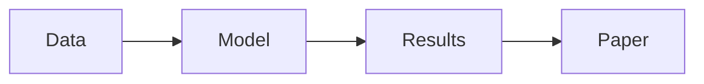
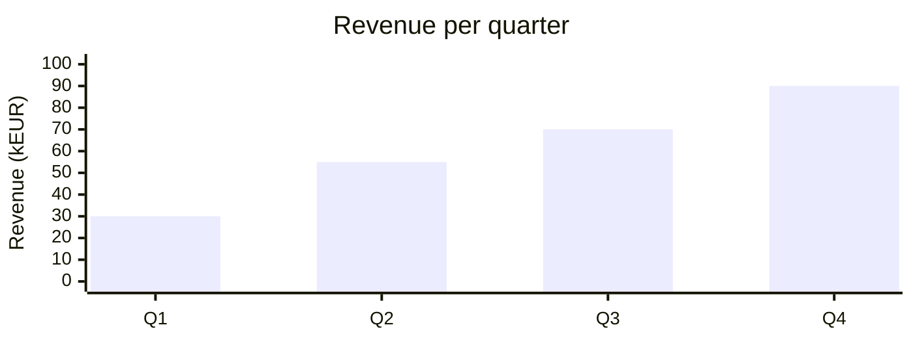
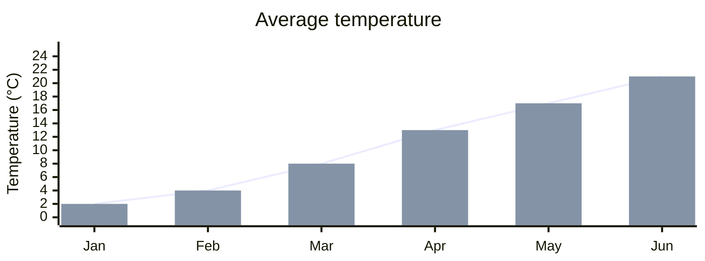

# This is my Presentation
## And this is my subtitle

---
layout: fzj-content
---

# Lists
## Bullets, numbers and nesting

- Unordered item
  - Nested item
  - Another nested item
- **Bold**, *italic*, ~~strikethrough~~ and `inline code`

1. First step
2. Second step
3. Third step

---
layout: fzj-content
---

# Click animations
## Reveal content step by step

<v-clicks>

- First point appears on the first click
- Then the second point
- Then the third point

</v-clicks>

<v-click>

This paragraph appears last, with <span v-mark.underline.orange>marked text</span>.

</v-click>

<!--
Presenter notes: an HTML comment at the end of a slide is shown in presenter mode only.
-->

---
layout: fzj-content
---

# Code
## Syntax highlighting

```ts
interface User {
  id: number
  name: string
}

function greet(user: User) {
  return `Hello, ${user.name}!`
}
```

---
layout: fzj-content
---

# Code
## Highlight lines step by step

```ts {1|3-4|all}
const items = [1, 2, 3]

const doubled = items.map(n => n * 2)
console.log(doubled)
```

---
layout: fzj-content
---

# Code
## Highlighted lines with line numbers

```python {2,3}{lines:true}
def mean(values):
    total = sum(values)
    return total / len(values)

print(mean([1, 2, 3, 4]))
```

---
layout: fzj-content
---

# Code
## Magic move between code steps

````md magic-move
```js
const count = 1
console.log(count)
```
```js
const count = 1
const next = count + 1
console.log(next)
```
````

---
layout: fzj-content
---

# Code
## Live editor (Monaco)

```ts {monaco}
const message: string = 'Edit me while presenting'
console.log(message)
```

---
layout: fzj-content
---

# Two columns
## Text and code side by side

::left::

- Left column
- Plain markdown
- Any content

::right::

```bash
npm install
npx slidev
```

---
layout: fzj-content
---

# Math
## LaTeX formulas

Inline: $E = mc^2$

$$
\int_0^\infty e^{-x^2}\,dx = \frac{\sqrt{\pi}}{2}
$$

---
layout: fzj-content
---

# Diagrams
## Mermaid



---
layout: fzj-content
---
 
# Charts
## Bar chart (Mermaid)
 

 
---
layout: fzj-content
---
 
# Charts
## Line plot (Mermaid)
 



---
layout: fzj-content
---

# Tables
## Standard markdown tables

| Feature | Syntax |
| --- | --- |
| Click animation | `<v-click>` |
| Line highlight | `` ```ts {2,3} `` |
| Math | `$$ \int $$` |

---
layout: fzj-content
---

# Images and icons
## HTML and UnoCSS utility classes

<div class="grid grid-cols-2 gap-6 items-center">
  
  <div class="text-3xl">
    <carbon-logo-github /> <carbon-logo-linkedin />
  </div>
</div>

---
transition: fade
---

# Text and quotes
## Links, quotes and colored text

> A blockquote for key messages.

See the [Slidev documentation](https://sli.dev) for more.

<span class="text-red-500">Colored text</span> with utility classes.

---
layout: fzj-content
---

# Thank you
## Questions?

Jane Doe, jane.doe@example.org
